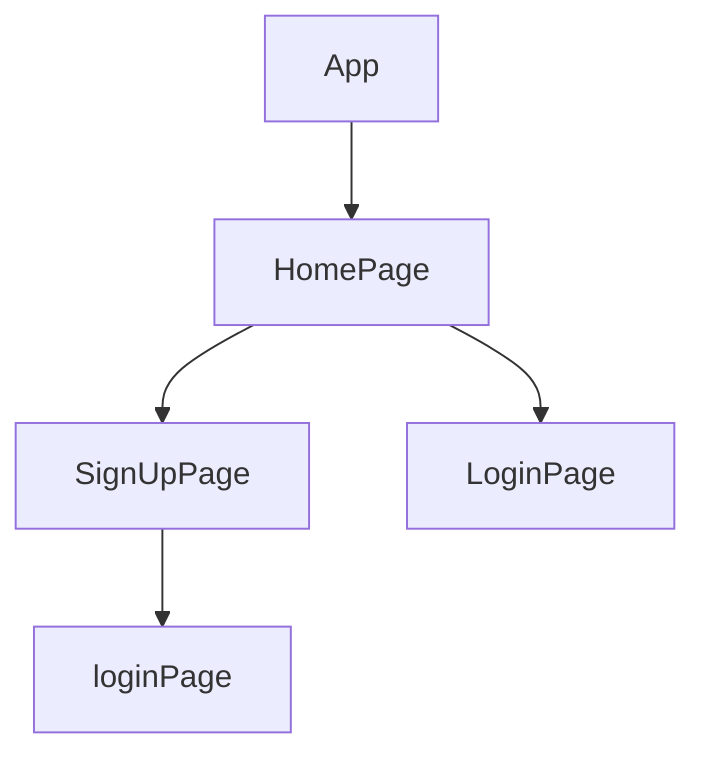

> 💻 PROJECT NAME ✨ => 💻 SkilltankWebsite

## 💫Tech-Stack->

- #### For Frontend:-
   - `HTML5`
  - `CSS3`
  - `JavaScript `
  - `ReactJS`
  - `ReactJS`
    - #### For Backend:-
   - `NodeJS`
   - `ExpressJS`
    - `MongoDB `
- #### For deploy database:- 
    
     - `Vercel`
   
- #### For Styling:-  
   - `Chakra UI `
  
- #### For live Project: -
   - `Vercel`
   

## ⭕Steps to run our project:

✨Clone the repository.

✨Run the command `npm install` in both the frontend and backend folders.

✨Run the command `npm run server` in the backend folder.

✨Run the command `npm start` in the frontend folder run on localhost:3000.

---
## Features ✨:-
---
 | Serial No            | Feature                                                              |
| ----------------- | ------------------------------------------------------------ |
| 1 | User signup login, and logout |
| 2 | Home Page designing |
| 3 | navbar, footer |

---
# Package.json(Dependency)✨:-

 | Serial No            | Backend                      |  Frontend      |
| ----------------- | ---------------------|------------------------ |
| 1 | bcrypt |   Chakra-ui |
| 2 | mongoose |  React Router dom |
| 3 | cors | redux, react-icons |
| 4 | dotenv |  react redux, axios |
| 5 | express | chakraUi-icons |
| 6 | jsonwebtoken | redux thunk |

---

## Flow

---

<h1 align="center">✨Thank You✨</h1>
